# 📘 Jacinto Bemelhor Access Model Documentation

*This is the golden source for understanding, contributing to, and running the ****Jacinto Bemelhor**** platform.*

---

## 🧭 Project Overview

Jacinto Bemelhor is a platform for sharing clinical cases of virtual patients and learning through quests. Access to resources is controlled through an advanced model of entitlements and invite tokens.

---

## 📦 Project Structure

### 🔙 Backend (Harena Manager)

The [`harena-manager`](https://github.com/gigennari/harena-manager/) repository serves as the backend of the application. It is a Django-based project that handles all the business logic, data storage, and API endpoints.

Main Contents:

- `models.py`: defines all database models
- `views.py`: contains all business logic and permission enforcement
- `serializers.py`: handles data representation for API endpoints
- `urls.py`: declares the routes for API endpoints
- `admin.py`: provides custom admin functionalities on the Django Admin Console
- `api.py`: lightweight API for Person model (used in admin/test context)
- `apps.py`: registers the Django app `harena`

### 🧑‍💻 Frontend (Harena Space)

The [`harena-space`](https://github.com/gigennari/harena-space/) repository is the frontend application, built with Next.js, that interacts with the `harena-manager` backend. It provides the user interface for the application.

Main Contents (`src`):
- `App.jsx`
- `main.jsx`
- `routes`: contains subdirectories that correspond to different components of the application

---

## 🛠️ Running the System

### ✅ Prerequisites

- Python 3.10+
- PostgreSQL
- Node.js + Yarn (for frontend)
- Docker
- Google Cloud  
- Django and Django REST Framework

### ▶️ Backend Setup

#### Update the `.env` secrets. 

**Generating `DJANGO_SECRET_KEY`:**
The DJANGO_SECRET_KEY is a critical security setting used by Django to provide cryptographic signing. It should be a long, random string. You can generate one using Python:

1. Open a Python interpreter (you can do this by typing python in your terminal).

2. Run the following commands:

```python
from django.core.management.utils import get_random_secret_key
print(get_random_secret_key())
```
3. Copy the output and paste it as the value for `DJANGO_SECRET_KEY` in your `.env` file.

**Generating `GOOGLE_CLIENT_ID`:**
The `GOOGLE_CLIENT_ID` is required for integrating Google OAuth into your application. This ID is obtained from the Google Cloud Console.

1. Go to the [Google Cloud Console](https://console.cloud.google.com/).

2. Create a new project or select an existing one.

3. Navigate to "APIs & Services" > "Credentials".

4. Click "Create Credentials" and choose "OAuth client ID".

5. Select "Web application" as the application type.

6. Configure the "Authorized JavaScript origins" and "Authorized redirect URIs". For local development, http://localhost:5173 (your `CLIENT_URL`) should be added to "Authorized JavaScript origins", and http://localhost:8080/auth/google/callback/ (or similar, depending on your callback URL) should be added to "Authorized redirect URIs".

7. After creating, your client ID will be displayed. Copy this ID and paste it as the value for `GOOGLE_CLIENT_ID` in your `.env` file.

**Email Configuration:**
The email configuration allows your Django application to send emails, such as invite tokens. You'll need to provide details for an SMTP server. The example uses smtp.gmail.com, but you can use any SMTP server.

- `EMAIL_PORT`: Common ports are 587 (for TLS) or 465 (for SSL).

- `EMAIL_HOST_USER`: Your email address for sending emails.

- `EMAIL_HOST_PASSWORD`: The password for the `EMAIL_HOST_USER`. If using Gmail, you might need to generate an App Password.

- `DEFAULT_FROM_EMAIL`: The email address that will appear as the sender for emails sent by the application.

After updating your `.env` file, proceed with the backend setup commands.

#### Run the Server
```bash
python -m venv .venv
.\.venv\Scripts\Activate.ps1
cd mundorum
python manage.py makemigrations
python manage.py migrate
python manage.py createsuperuser
python manage.py runserver
```

For more information, check these four key files:
* [setup-postgresql.md](docs/setup-postgresql.md): to set the PostgreSQL DBMS for the first time;
* [setup-django.md](docs/setup-django.md): to set the Django server for the first time;
* [run.md](docs/run.md): to run the server as the setup is configured;
* [step-by-step.md](docs/step-by-step.md): to understand step-by-step how this server setup was produced.

### 💻 Frontend Setup 

#### Update the `.env` secrets.

**Defining the `VITE_SERVER_URL`**:

This variable specifies the URL of your backend server. By default, it's set to `http://localhost:8000`, which is a common development server address for Django. If your `harena-manager` backend is running on a different port or host, you will need to update this value accordingly.

**Generating VITE_GOOGLE_CLIENT_ID:**
The `VITE_GOOGLE_CLIENT_ID` is the same `GOOGLE_CLIENT_ID` that you generated for your backend setup. It's obtained from the Google Cloud Console.

#### Run the Client 
```bash
npm run dev 
```

For mor information, check this three key files:
* [setup.md](https://github.com/gigennari/harena-space/blob/main/docs/setup.md): to set the npm environment for the first time;
* [run.md](https://github.com/gigennari/harena-space/blob/main/docs/run.md): to run the Vite server as the setup is configured;
* [step-by-step.md](https://github.com/gigennari/harena-space/blob/main/docs/step-by-step.md): to understand step-by-step how this server setup was produced (under construction).
---


## 🏛️ Entities and Attributes 


| Entity                   | Description                                                                             | Key Attributes                                                               |
| ------------------------ | --------------------------------------------------------------------------------------- | ---------------------------------------------------------------------------- |
| **Institution**          | An organization (e.g., university, school). Holds users and quests.                   | `id`, `name`, `active`, `owner`                                              |
| **InstitutionDomain**    | Links email domains to institutions.                      | `name`, `institution`                                                        |
| **Person**               | Represents a user (student, professor, guest, owner).                                   | `user`, `google_id`, `role`, `institution`, `profile_picture`, `birth`       |
| **Quest**                | A learning group or collection of cases.                                                | `id`, `name`, `institution`, `owner`, `visible_to_institution`               |
| **Case**                 | A clinical case included in quests.                                                     | `id`, `name`, `description`, `content`, `answer`, `possible_answers`, `specialty`, `complexity`, `case_owner`, `image` |
**QuestCase**              | Relationship between quests and cases | `quest_id`, `case_id`
| **QuestAccessToken**     | A token used to invite users to a specific quest with predefined roles and permissions. | `token`, `quest`, `role`, `group`, `expires_at`, `max_uses`, `used_by`       |
| **ProfessorInviteToken** | A token used by institution owners to invite users to join as professors.               | `token`, `email`, `institution`, `expires_at`, `is_used`                     |


---

## 👤 User Roles

| Role          | Description                                          |
| ------------- | ---------------------------------------------------- |
| **guest**     | Temporary, limited access via invite                 |
| **student**   | Authenticated with institutional email               |
| **professor** | Authenticated with institutional email               |


⚠️ **Institution owner** and **quest owner** are not roles, but attributes within the Institution and the Quest.

---

## 👥 Group-based Access

Each quest dynamically creates three Django Groups:

- `viewers_<quest_id>` → can view cases
- `authors_<quest_id>` → can add cases
- `editors_<quest_id>` → can add, remove, reorder cases, invite other users to the quest using a `QuestAccessToken`

---

## 🧩 Tokens: Authentication and Invitations

### 1. 🔐 Standard Login

- Auth via Google
- Email domain must match active institution
- Role assigned: `student`

### 2. 🧑‍🏫 Professor Invite Token

- Issued by institution owner
- Limited to a specific email
- Once the token is issued, the professor gets a link via email
- On usage:
  - Validates email & expiration
  - Assigns role = `professor`
  - Links to institution

### 3. 🧩🎯 Quest Access Token

Used to invite users to participate in a specific quest.

| Field        | Description                                                  |
| ------------ | ------------------------------------------------------------ |
| `role`       | Role assigned to user (e.g. `guest`, `student`, `professor`) |
| `group`      | Group to assign (e.g. `viewer`, `author`, `editor`)          |
| `max_uses`   | Optional usage cap                                           |
| `expires_at` | Expiration datetime                                          |

✅ **Dynamic behavior**:

- If role = `guest` → account created if needed
- If role = `student/professor` → user must already belong to matching institution

Sample usage URL:

```bash
https://clienturl.com/invite/quest/<token>
```

---

## 🔐 Permissions Matrix

| Resource | Action | Institution Owner | Quest Owner | Professor | Student | Viewer | Author | Editor | Guest |
| :---------- | :------------------ | :---------- | :---------- | :---------- | :---------- | :---------- | :---------- | :---------- | :---------- |
| Institution | Invite Professor | ✅ | ❌ | ❌ | ❌ | ❌ | ❌ | ❌ | ❌ |
| Quest | Create | ✅ | ❌ | ✅ | ❌ | ❌ | ❌ | ❌ | ❌ |
| Quest | View (Public) | ✅ | ✅ | ✅ | ✅ | ✅ | ✅ | ✅ | ✅ |
| Quest | View (Private)\* | ❌| ✅ | ❌ | ❌ | ✅ | ✅ | ✅ | ❌ |
| Quest | Add Case | ❌ | ✅ | ❌ | ❌ | ❌ | ✅ | ✅ | ❌ |
| Quest | Remove Case | ❌ | ✅ | ❌ | ❌ | ❌ | ❌  | ✅ | ❌ |
| Quest | Delete | ❌ | ✅ | ❌ | ❌ | ❌ | ❌ | ❌ | ❌ |
| Quest | Invite to Quest | ❌ | ✅ | ❌ | ❌ | ❌ | ❌ | ✅ | ❌ |
| Case | View (Own Case) | ✅ | ✅ | ✅ | ✅ | ✅ | ✅ | ✅ | ✅ |
| Case | Create | ✅ | ✅ | ✅ | ✅ | ✅ | ✅ | ✅ | ✅ |
| Case | Edit (Own Case) | ✅ | ✅ | ✅ | ✅ | ✅ | ✅ | ✅ | ✅ |

-> * Only if added via Token

---

## 🖼️ Diagrams


### 🧬 Database Model Schema

The database schema is defined in [`models.py`](mundorum/harena/models.py). The diagram below provides a visual overview of the models and their relationships.

**Schema Diagram Path:** 


---


## ⚙️ Backend Architecture

### Key Python Files

| File | Description |
| :--- | :--- |
| [`views.py`](mundorum/harena/views.py) | Contains the core application logic for handling API requests. This includes user authentication, creating quests, managing tokens, etc. |
| [`models.py`](mundorum/harena/models.py) | Defines the database schema, including all tables, fields, and relationships. |
| [`serializers.py`](mundorum/harena/serializers.py) | Defines how complex data types, like model instances, are converted to and from JSON for API communication. |
| [`urls.py`](mundorum/harena/urls.py) | Maps URL endpoints to their corresponding views in `views.py`. |
| [`admin.py`](mundorum/harena/admin.py) | Configures the Django admin interface for managing the application's data. |

### API Endpoints

The following are the main API endpoints exposed by the backend.

| Method | URL Pattern | View Name | Description |
| :------- | :------------------------------------------- | :--------------------------- | :------------------------------------------------------------------- |
| **POST** | `/auth/google/` | `GoogleAuthView` | Handles user login and registration using a Google ID token. Also processes `ProfessorInviteToken` and `QuestAccessToken` if provided. |
| **GET** | `/user/` | `UserView` | Retrieves the profile information for the currently authenticated user. |
| **POST** | `/api/invite/professor/` | `InviteProfessorView` | Creates and sends a new `ProfessorInviteToken` via email. |
| **POST** | `/api/quest-access-token/` | `CreateQuestAccessTokenView` | Creates a new `QuestAccessToken` to invite users to a quest. |
| **POST** | `/api/use-quest-token/` | `UseQuestAccessTokenView` | Allows a user to use a `QuestAccessToken` to gain access to a quest. |
| **GET** | `/api/quests/<uuid:quest_id>/` | `QuestDetailView` | Retrieves details for a specific quest. |
| **POST** | `/api/quests/create/` | `CreateQuestView` | Creates a new quest. |
| **GET** | `/api/quests/` | `QuestListView` | Lists all quests visible to the authenticated user. |
| **GET** | `/api/quests/<uuid:quest_id>/cases/` | `QuestCasesView` | Lists all cases associated with a specific quest. |
| **POST** | `/api/quests/<uuid:quest_id>/cases/add/` | `AddCaseToQuestView` | Adds a case to a quest. |
| **DELETE** | `/api/quests/<uuid:quest_id>/cases/<uuid:case_id>/remove/` | `RemoveCaseFromQuestView` | Removes a case from a quest. |
| **GET** | `/api/quests/editable/` | `EditableQuestListView` | Gets quests a user can edit. |
| **GET** | `/api/quests/<uuid:quest_id>/access-tokens/` | `QuestAccessTokenListView` | Lists all active invitation tokens for a specific quest. |
| **POST** | `/api/cases/create/` | `CreateCaseView` | Creates a new case. |
| **GET** | `/api/cases/mycases/` | `UserCaseListView` | Lists all cases created by the authenticated user. |
| **GET, PUT/PATCH, DELETE** | `/api/cases/<uuid:pk>/` | `CaseDetailView` | Retrieves details for a specific case. |


---

## 🖥️ Frontend Architecture

### Key React Components

| Component | Description |
| :-------------------- | :---------------------------------------------------------------------------------------------------------------------      |
| `App.jsx` | The root component that sets up the application's routing using `react-router-dom`.                                                     |
| `Login.jsx` | The main landing and login page. Handles Google authentication and token-based invites.                                               |
| `Quests.jsx` | Displays a list of all quests available to the current user.                                                                         |
| `QuestCases.jsx` | The "player" interface where users interact with the cases within a specific quest.                                              |
| `QuestEditor.jsx` | An administrative interface for quest owners/editors to manage a quest's details and its associated cases.                      |  
| `CreateQuest.jsx` | A form for professors to create new `Quests`.  
| `InviteToQuest.jsx` | A form for quest owners/editors to generate new `QuestAccessToken`s to invite others.                                         |
| `SeeInvitations.jsx` | A view for quest owners/editors to see all active invitation tokens, their usage, and expiration dates for a specific quest. |
| `QuestInviteRedirect.jsx` | A simple component that handles the redirect flow for users who click a quest invitation link, sending them to the login page. |
| `CreateCase.jsx` | A form component that allows users to create new clinical cases, including entering case details and submitting them to the backend. |
| `MyCases.jsx` | Displays a list of all clinical cases created by the current user, in a published or draft state, allowing them to view, edit, delete or manage their own cases. |
| `InviteProfessor.jsx` | Allows institution owners to generate professor invitation links and automatically send them via email. |


-----


## 🖼️ UI Walkthroughs

* **User Login and Registration Flow**
    * *Video/GIF of a new institutional user logging in for the first time. (TBD)*
    
    * *Video/GIF of a professor user using a professor invite link. (TBD)*
    
    * *Video/GIF of a guest user using a quest invite link.(TBD)*
    

* **Generating and Using Invite Links**
    * Inviting a Professor:
        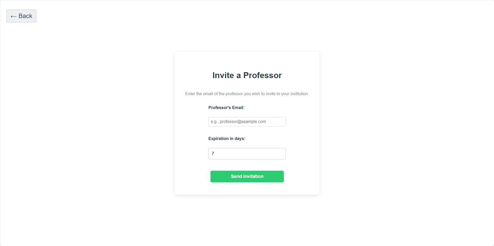
    * Inviting to Quest:
        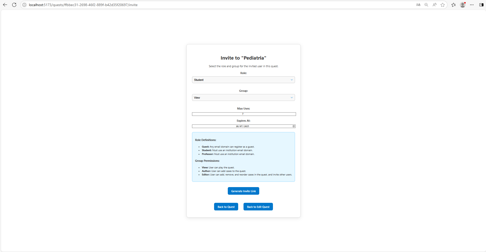
    * *Screenshot of the 'See All Invitations' page. (TBD)*

* **Quest Creation and Management**
    * Creating a Quest:
        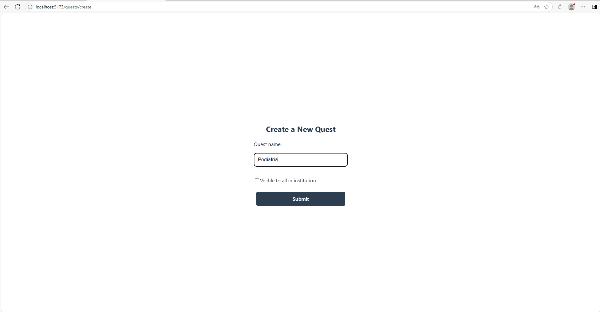
    * New Quest Created:
    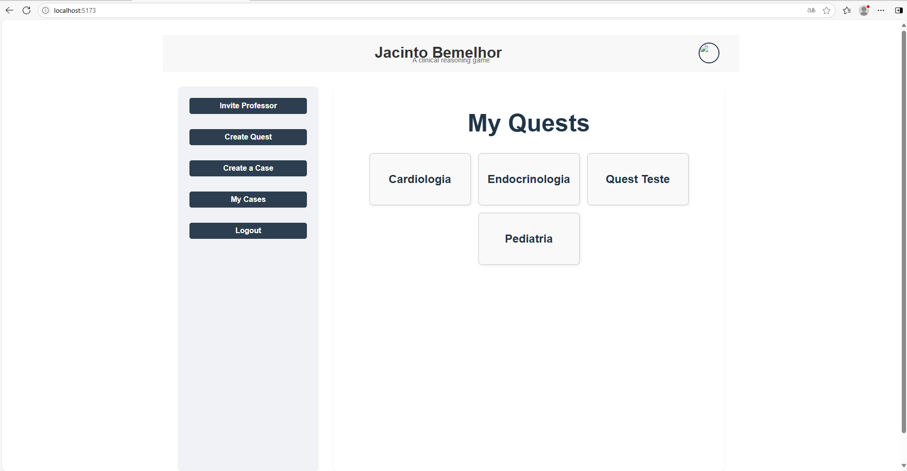
    * Editing a Quest:
        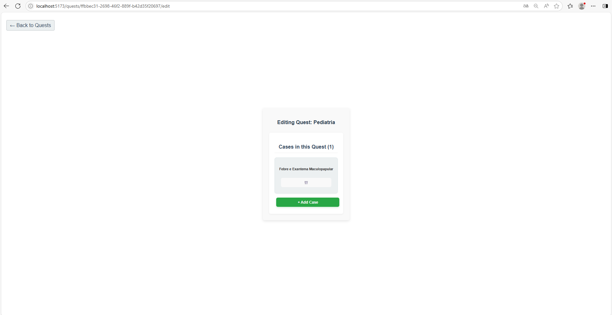


* **Creating and Editing Cases**
    * Creating a Case:
        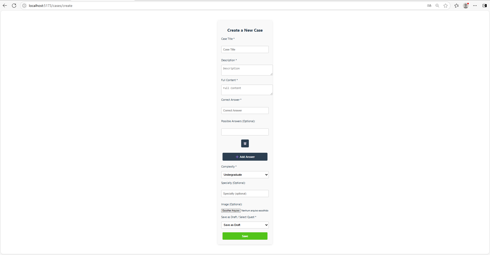
    * My Cases:
        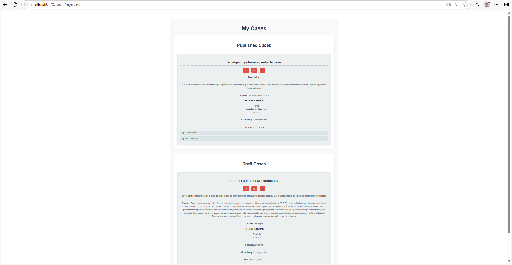
    * Editing a Case:
        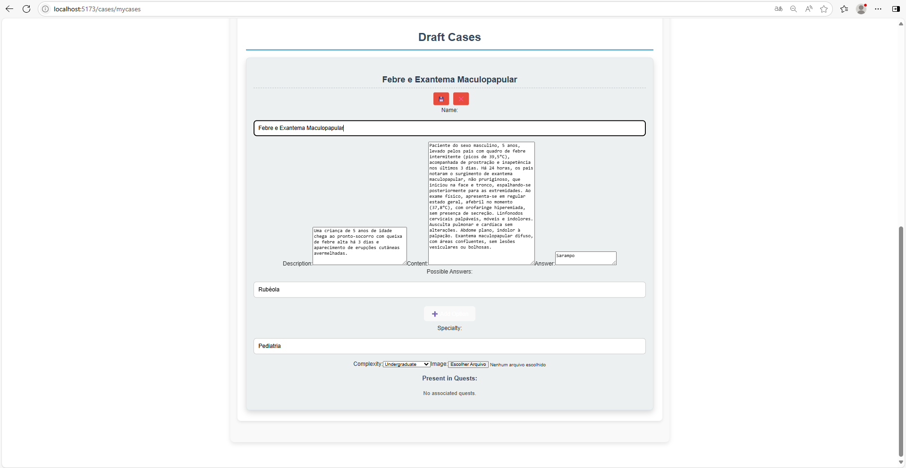
    * New Ped Case:
        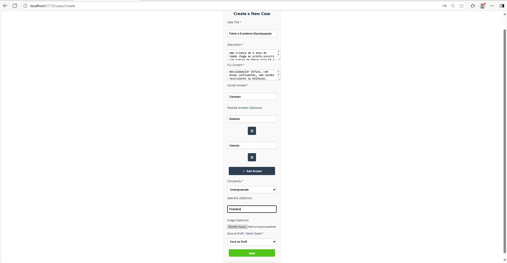
    * Publishing a Case:
        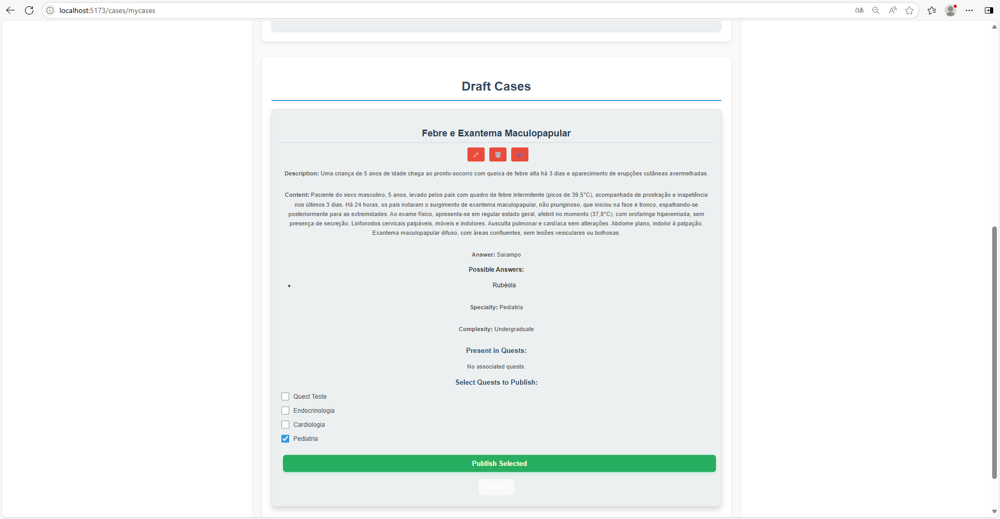
    * Updated Cases:
        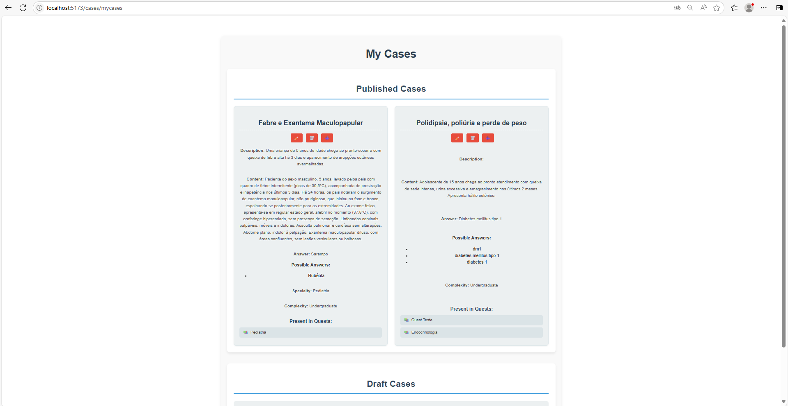
    * Quest with New Case:
        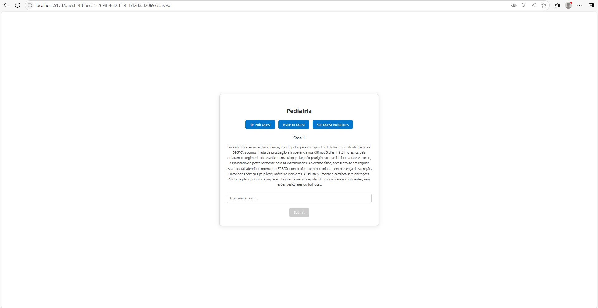


<!-- end list -->


---

## Opportunities for Improvement 

This section outlines potential enhancements to the Jacinto Bemelhor system, focusing on features that would improve quest management, collaboration, data tracking, and information transparency.

### 1. Ordered Cases in Quests
Currently, the order of cases within a quest depend on addition time. Introducing an explicit ordering mechanism would allow for more structured and progressive quest design.

Elaboration: This improvement would involve adding a new column, such as `order_index` or `sequence_number`, to the `QuestCase` model table. This integer column would define the specific position of each case within its parent quest. When displaying a quest, cases would be retrieved and presented according to this `order_index`. This is crucial for quests that require a specific flow or narrative progression, ensuring that players encounter challenges or information in a predetermined sequence. It also simplifies the process of reordering cases without needing to delete and recreate them.

### 2. Allow Cases to be Shared/Co-owned
In a collaborative environment, the ability to share or co-own cases would significantly enhance teamwork and content creation.

Elaboration: This feature would enable multiple users to have edit or view access to a single `Case`. This could be implemented by introducing a many-to-many relationship between `Users` and `QuestCases` (e.g., through an intermediate `CasePermissions` table), or by adding a `shared_with_users` array field to the `QuestCase` model. Co-ownership would imply that multiple users have full editing rights, while sharing could involve different permission levels (e.g., view-only, edit, comment). This is particularly beneficial for large projects where different team members might be responsible for various parts of a quest, allowing for parallel development and easier integration.

### 3. Store Players' Scores on Quests
Tracking player performance is essential for gamification, analytics, and providing feedback. Storing scores directly on quests would enable more robust progression tracking.

Elaboration: This improvement would require a new model or table, perhaps named `PlayerQuestScore` or `QuestCompletionRecord`, which would link a Player (`User`) to a `Quest` and store their score for that specific quest. Additional fields could include `completion_date`, `time_taken`, or `highest_score` (if multiple attempts are allowed). This data is vital for leaderboards, performance analysis, rewarding players, and personalizing future quest recommendations. It allows for a clear record of a player's achievement within the context of each quest they undertake.

### 4. Keep Information About the Owner and the Last Update Date on Cases
Maintaining metadata about content ownership and modification history is crucial for accountability, auditing, and understanding content evolution.
Elaboration: This can be achieved by adding two additional columns to the `Case` model: one for the user who last edited the case (e.g., `last_updated_by_id`, linking to the User) and one for the time of the last update (e.g., `last_updated_at`, a timestamp). This approach ensures that each case records who made the most recent changes and when, providing clear accountability and a transparent modification history.

### 5. Institution Owner Full Quest Oversight

Currently, institution owners have limited visibility and control over quests, especially private ones. Enhancing their permissions to view, edit, and moderate all quests within their institution would improve governance and compliance.

Elaboration: This improvement would grant institution owners the ability to:
- View all quests (including private ones) within their institution.
- Edit any quest and its associated cases, regardless of ownership.
- Delete cases that violate medical regulations, are too sensitive, or contain incorrect information.

This change ensures that institution owners can uphold institutional standards, enforce compliance, and maintain the integrity of shared content. Implementation would involve updating permission checks in the backend to allow institution owners elevated access to all quests and cases under their institution.

Additionally, institution owners should have the authority to delete cases that violate community guidelines, breach medical ethical standards, or are outdated or factually incorrect. This ensures that all shared content remains accurate, ethical, and aligned with the institution's values and regulatory requirements.


---

## ✨ Acknowledgments

Jacinto Bemelhor is developed by the Harena Lab — Unicamp.

Maintained by: @santanche\
Access Model implemented by: @gigennari

---

## 📫 Contact

For questions or contributions, reach out via [GitHub Issues](https://github.com/harena-lab/harena-docs/issues) or email the maintainer.

---

