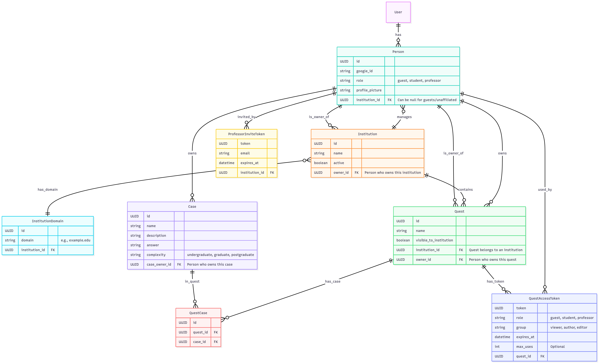
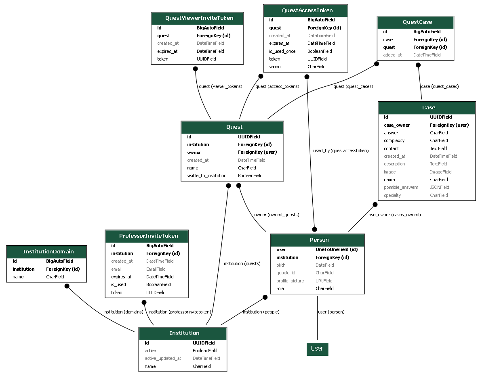

# Harena Manager New Generation

Four key files:
* [setup-postgresql.md](docs/setup-postgresql.md): to set the PostgreSQL DBMS for the first time;
* [setup-django.md](docs/setup-django.md): to set the Django server for the first time;
* [run.md](docs/run.md): to run the server as the setup is configured;
* [step-by-step.md](docs/step-by-step.md): to understand step-by-step how this server setup was produced.


# 📜 Jacinto Bemelhor — Access Model Documentation

## 🔐 Overview

This document describes the **entitlement and access model** for the Jacinto Bemelhor platform, focusing on the relationships between users, institutions, quests, and cases. It also explains how permissions are assigned based on roles, ownership, and group membership.

---

## 🏛️ Entities and Attributes

| Entity       | Description                                |
|---------------|--------------------------------------------|
| **Institution** | An organization (e.g., university, hospital). Holds users and quests. |
| **Person**    | Represents a user (student, professor, guest, owner). |
| **Quest**     | A learning group or collection of cases.   |
| **Case**      | A clinical case included in quests.        |

---

## 👥 Person Model

| Attribute       | Description                                   |
|-----------------|-----------------------------------------------|
| `id`            | Unique identifier                            |
| `user`          | Django user reference                        |
| `email`         | Email address                                |
| `name`          | Full name                                    |
| `role`          | One of: `owner`, `professor`, `student`, `guest` |
| `institution`   | Institution the user belongs to              |
| `google_id`     | Google account ID                            |
| `profile_picture`| URL of the profile picture                  |

### 🔑 Roles and Permissions

| Role       | Description                               |
|------------|-------------------------------------------|
| **owner**  | Owner of an institution. Manages all quests and users. |
| **professor** | Can create and manage quests within their institution. |
| **student** | Can view quests they are allowed to access. |
| **guest**   | Temporary users linked via invite tokens for specific quests. |

---

## 🏢 Institution Model

| Attribute     | Description                                |
|----------------|--------------------------------------------|
| `id`          | Unique UUID                                |
| `name`        | Institution name                           |
| `active`      | Whether the institution is active          |
| `active_updated_at` | Timestamp of last status update      |
| **owner**     | The person with role `owner` for this institution |

### 🔐 Access Rules
- An **institution owner** has full admin rights.
- Professors and students are linked to a single institution.
- Only active institutions allow login and quest access.

---

## 📚 Quest Model

| Attribute      | Description                                |
|----------------|--------------------------------------------|
| `id`           | Unique UUID                                |
| `name`         | Quest name                                 |
| `institution`  | Linked institution                         |
| `owner`        | Quest owner (usually a professor)         |
| `authors`      | Users with edit permissions on this quest |
| `viewers`      | Users who can view and participate        |
| `institution_visibility` | Boolean: if true, quest is visible to all members of the institution |

### 🔐 Quest Access Rules

| Action                  | Permission                                    |
|-------------------------|-----------------------------------------------|
| **Create quest**        | Institution owner or professor                |
| **Edit quest**          | Quest owner and authors                       |
| **View quest (private)**| Quest owner, authors, viewers                 |
| **View quest (public)** | If `institution_visibility=True`, then all users in the institution |
| **Manage cases**        | Quest owner and authors                       |

---

## 🩺 Case Model

| Attribute      | Description                                   |
|----------------|-----------------------------------------------|
| `id`           | Unique UUID                                   |
| `name`         | Case name                                     |
| `description`  | Clinical description                          |
| `quest_set`    | Quests that include this case                 |
| `answer`       | Correct diagnosis                             |
| `answer_options` | List of valid alternative answers (normalized) |

---

## 🔗 Access Token Model (QuestAccessToken)

| Variant            | Description                                                            |
|--------------------|------------------------------------------------------------------------|
| `viewer_existing`  | Adds existing authenticated user as **viewer** to a quest              |
| `author_existing`  | Adds existing authenticated user as **author** to a quest              |
| `viewer_guest`     | Creates a **guest** user and adds as **viewer** to the quest           |

### 📜 Example Token Link:

```
https://clienturl.com/invite/quest/<token>
```

---

## 🔐 Permissions Matrix

| Resource    | Action        | Owner | Professor | Author | Viewer | Student | Guest |
|--------------|---------------|-------|-----------|--------|--------|---------|-------|
| **Institution** | Manage       | ✔️    | ❌        | ❌     | ❌     | ❌      | ❌    |
| **Quest**       | Create       | ✔️    | ✔️        | ❌     | ❌     | ❌      | ❌    |
|                 | Edit         | ✔️    | ✔️        | ✔️     | ❌     | ❌      | ❌    |
|                 | View (public)| ✔️    | ✔️        | ✔️     | ✔️     | ✔️      | ❌    |
|                 | View (private)| ✔️    | ✔️        | ✔️     | ✔️     | ❌      | ✔️*   |
| **Case**        | View         | ✔️    | ✔️        | ✔️     | ✔️     | ✔️      | ✔️    |

→ *Guest users can view quests when invited with `viewer_guest` tokens.

---

## 🏗️ Diagram — Access Model



## 🏗️ Model Schema 



---

## 🎯 Summary of Rules

- ✅ **Institution owner** manages the institution and all its quests.
- ✅ **Professors** can create quests and manage viewers/authors.
- ✅ **Authors** help maintain and edit a quest.
- ✅ **Viewers** can only interact with the quest (solve cases, view content).
- ✅ **Students** see quests visible institution-wide (`institution_visibility=True`).
- ✅ **Guests** can only access quests when invited with a token (`viewer_guest`).

---


